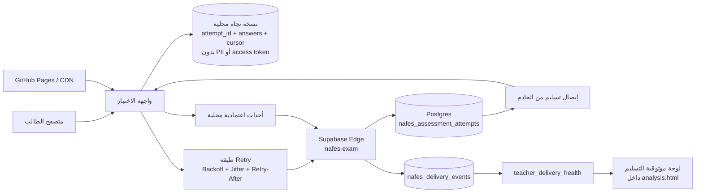

# تقرير اعتمادية تسليم الاختبارات الإلكترونية

**المنصة:** معلّمي — نافس  
**التاريخ:** 7 أكتوبر 2026  
**النطاق:** تحسين التسليم دون إعادة تصميم المنصة أو استبدال Supabase/GitHub Pages.

## 1. الملخص التنفيذي

تمت معالجة مشكلة فشل تسليم الاختبارات بإضافة طبقات حماية فوق البنية الحالية بدل استبدالها. يعتمد الحل على مبدأ أن الإجابة تُحفظ محليًا أولًا ثم تُزامن إلى الخادم، وأن التسليم النهائي يجب أن يكون قابلًا للتكرار بأمان (Idempotent) وأن يصدر عنه إيصال من الخادم.

الطبقات المنفذة:

1. حفظ تلقائي للخادم بعد الإجابة ودوريًا.
2. نسخة نجاة محلية دائمة للإجابات داخل المتصفح، دون تخزين اسم الطالب أو أرقام الهوية أو مفتاح الوصول.
3. إعادة محاولة تلقائية للطلبات المؤقتة مع Backoff وJitter ودعم Retry-After.
4. الاحتفاظ بـ “نية التسليم” إذا انقطع الاتصال أثناء الضغط على زر التسليم.
5. إعادة إرسال التسليم تلقائيًا عند عودة الاتصال.
6. جعل تسليم الاختبارات القديمة Idempotent؛ إعادة نفس التسليم بعد نجاحه لا تعطي خطأ 409.
7. إيصال تسليم يولده الخادم بعد اعتماد المحاولة.
8. نافذة استرداد مدتها دقيقتان بعد انتهاء الوقت لمزامنة إجابات كانت محفوظة محليًا بسبب انقطاع الشبكة، وليست وقتًا إضافيًا للإجابة.
9. Telemetry خفيف لا يخزن محتوى الإجابات.
10. لوحة مراقبة للمعلم داخل صفحة التحليل.

## 2. تحليل السبب الجذري

### 2.1 البيانات الفعلية من سجلات الإنتاج

في نافذة السجلات التي فُحصت لمسار `/functions/v1/nafes-exam`:

| HTTP | عدد الطلبات | المتوسط | P95 | الدلالة |
|---|---:|---:|---:|---|
| 200 | 15,004 | 664.7ms | 1,186ms | أغلب الطلبات تعمل بصورة طبيعية |
| 409 | 206 | 1,008.4ms | 1,799.5ms | تعارضات جلسة/حالة أو عمليات إدارية، وليس كلها فشل تسليم |
| 404 | 56 | 444.7ms | 608ms | غالبًا عدم تطابق هوية الطالب |
| 403 | 28 | 715.3ms | 1,370.8ms | نافذة إتاحة أو صلاحية |
| 400 | 2 | 2,607.5ms | 3,106.5ms | طلبات غير صالحة |
| 520 | 2 | 17,461.5ms | 24,598.9ms | فشل Gateway/Edge بطيء يستحق المعالجة |

السجلات النوعية أظهرت أيضًا:
- حالات قليلة لقفل محاولة مفتوحة في تبويب/جهاز آخر.
- عدد من 409 متعلق ببناء بنك الأسئلة وليس تسليم الطلاب.
- الخادم ليس في حالة فشل جماعي؛ الحلقة الأضعف كانت حماية البيانات على جهاز الطالب عند انقطاع الاتصال، إضافة إلى سلوك التسليم القديم غير الـIdempotent.

### 2.2 العيوب التي تم تحديدها

**المشغل الحديث قبل الإصلاح:** كان يحتفظ بمفتاح الاستئناف في Session Storage، لكن الإجابات نفسها لم تكن محفوظة بشكل دائم في Local Storage. إغلاق التبويب أو انهيار المتصفح قبل وصول آخر حفظ يمكن أن يفقد إجابات لم تصل للخادم.

**المشغل القديم قبل الإصلاح:** إذا نفذ الخادم `finish` بنجاح ثم ضاعت استجابة HTTP، فإن إعادة `finish` كانت تُرجع 409 “تم تسليم هذه المحاولة سابقًا”. من جهة الطالب تبدو العملية فاشلة رغم أن الخادم حفظها بالفعل.

**وقت انتهاء الاختبار:** إذا استمر الانقطاع حتى لحظة انتهاء الوقت، يمكن أن يعتمد الخادم آخر نسخة وصلت إليه ويتجاهل إجابات بقيت فقط على الجهاز.

**المراقبة:** لم يكن هناك سجل مستقل يقيس offline/retry/recovered/receipt، لذلك كان من الصعب التمييز بين ضعف الشبكة، فشل الخادم، وفشل واجهة العميل.

## 3. المعمارية المحدثة

### مسار الإجابة

1. يختار الطالب الإجابة.
2. تُكتب مباشرة في كائن الواجهة والنسخة المحلية.
3. يبدأ Auto-save إلى Edge Function.
4. إذا فشل الاتصال تبقى النسخة المحلية.
5. عند عودة الاتصال تُزامن الإجابات تلقائيًا.

### مسار التسليم النهائي

1. عند الضغط على التسليم تُحفظ `finish_requested=true` محليًا قبل الشبكة.
2. ترسل الواجهة الطلب مع جميع الإجابات.
3. يعالج الخادم التسليم مرة واحدة.
4. إذا ضاعت الاستجابة بعد Commit، تعيد الواجهة الطلب.
5. الخادم يعيد نجاحًا وإيصالًا بدل خطأ “سبق التسليم”.
6. بعد ظهور إيصال الخادم تُحذف نسخة النجاة المحلية.

## 4. تغييرات التنفيذ

### الواجهة

- `edge-retry.js`
  - retry للحالات 408/425/429/500/502/503/504/520/522/524.
  - حتى 5 محاولات للعمليات الحرجة.
  - احترام `Retry-After`.
  - Backoff + Jitter.

- `e-player-demo-fix.js`
  - Local draft دائم.
  - استعادة إجابات بعد Refresh/إعادة الفتح لنفس المحاولة.
  - Queue لأحداث الاعتمادية.
  - إعادة التسليم تلقائيًا.
  - إيصال التسليم.
  - مهلة شبكة أطول للحفظ والتسليم.

- `exam.js`
  - حماية مماثلة لمسار اختبارات المؤشر القديم.
  - Local draft وتسليم مؤجل تلقائي.
  - عرض إيصال التسليم.

### الخادم

- `nafes-exam` v105 ACTIVE وقت المراجعة النهائية.
- التسليم الحديث والقديم يدعمان إيصالًا.
- التسليم القديم أصبح Idempotent.
- دقيقتان Recovery Grace بعد انتهاء الوقت لمزامنة إجابات موجودة مسبقًا محليًا.
- `assessment_delivery_event` يسجل أحداث الاعتمادية بعد التحقق من attempt/access token.
- `teacher_delivery_health` يعيد مؤشرات المراقبة بحسب نطاق معلم المادة.

### قاعدة البيانات

جدول `nafes_delivery_events` مع RLS، وصول service_role فقط، وفهارس بحسب المحاولة/الاختبار/الحدث/الوقت.

لا يخزن:
- نص الإجابات.
- خيارات الطالب.
- الاسم أو رقم الهوية في حدث الاعتمادية.

## 5. البنية التحتية والتوزيع

لا يوصى حاليًا ببناء طبقة خوادم جديدة أو VM Autoscaling منفصلة. السبب أن بيانات الإنتاج تظهر أن المسار الحالي ينجح في الغالب، وSupabase Edge موزع ومدار بالفعل، بينما GitHub Pages يخدم الملفات الثابتة عبر بنية CDN.

الأولوية الحالية:
- تقليل حجم وأثر كل طلب.
- retries مضبوطة لا تؤدي إلى Retry Storm.
- الاعتماد على Edge + Postgres الحاليين.
- مراقبة p95 و5xx/520 قبل زيادة الموارد.

يُنصح بتوسيع الموارد فقط إذا أظهرت نافذة تشغيل فعلية أن:
- p95 للحفظ > 2 ثانية باستمرار تحت حمل المدرسة.
- 5xx/52x > 0.5% لمدة 10 دقائق.
- Postgres/Edge يظهر اختناقًا موثقًا وليس انقطاعًا لدى العميل.

## 6. خطة التنفيذ والموارد

| المرحلة | الحالة | العمل | الموارد |
|---|---|---|---|
| تشخيص السجلات | مكتمل | تحليل status/latency/errors | مهندس واحد |
| طبقة Retry | مكتمل | Backoff/Jitter/Retry-After | مهندس واحد |
| Local durable draft | مكتمل | حديث + قديم | مهندس واحد |
| Idempotent finish + receipt | مكتمل | خادم + واجهة | مهندس واحد |
| Telemetry + dashboard | مكتمل | DB + API + UI | مهندس واحد |
| Contract + chaos CI | جارٍ ضمن خط النشر | منع الانحدار | CI |
| مراقبة إنتاج | مستمرة تشغيليًا | 1h/24h/72h | معلم/دعم |
| Load test على Staging | قبل أي توسع للبنية | 100/500/1000+ متزامن | مهندس واحد |

## 7. عتبات التشغيل

- أخطاء التسليم النهائية: الهدف < 0.1%.
- فقد إجابات في محاكاة الاسترداد: 0.
- Duplicate final records: 0.
- p95 حفظ عادي: الهدف < 2s.
- Pending submissions في اللوحة: يجب مراجعتها فورًا أثناء نافذة اختبار نشطة.
- 520/522/524: تنبيه إذا تكررت أو تجاوزت 0.5% من طلبات نافذة 10 دقائق.

## 8. خطة التراجع

التراجع لا يتطلب حذف بيانات الطلاب.

1. إعادة ملفات الواجهة السابقة من Git.
2. نشر الإصدار السابق من Edge Function إذا ثبت أن الخلل من منطق التسليم الجديد.
3. يمكن ترك `nafes_delivery_events` بدون استخدام؛ لا حاجة لحذفه أثناء التراجع.
4. لا يُحذف الجدول إلا بقرار صريح لأن الحذف مدمر.
5. إعادة Recovery Grace إلى المنطق السابق إذا كانت سياسة الاختبار تمنع أي مهلة مزامنة بعد الوقت.

## 9. ما لم يتم اعتماده كحل

- إرسال الإجابات بالبريد الإلكتروني: مرفوض كمسار طبيعي بسبب النزاهة والخصوصية وصعوبة إثبات النسخة الصحيحة.
- إنشاء تطبيق جوال مستقل الآن: كلفة تشغيل وصيانة لا تبررها البيانات الحالية.
- إعادة بناء المنصة: غير ضرورية.
- زيادة الخوادم دون قياس: لا تعالج فقد البيانات عند العميل.
