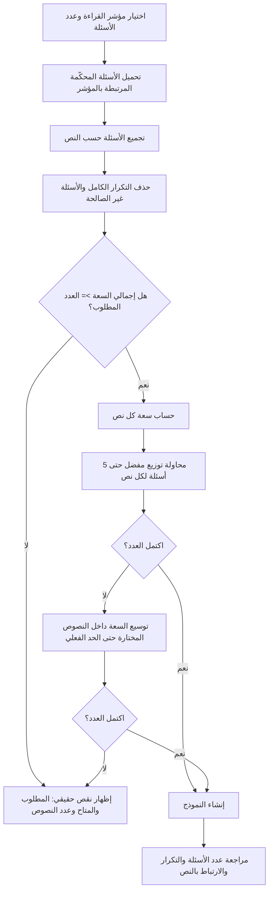

# تقرير هندسي: معالجة نقص موارد النصوص في بناء اختبارات القراءة

## 1. تعريف المشكلة
كان محرك بناء اختبار القراءة يفترض أن كل مجموعة نصية يجب أن تقدم **5 أسئلة كاملة**. لذلك كان عدد النصوص المطلوب يحسب تقريبًا على أساس:

`عدد النصوص = عدد الأسئلة ÷ 5`

هذا الافتراض لا يطابق البنية الفعلية لبنك القراءة دائمًا. البنك يحتوي حالات مثل:
- نصان، ولكل نص 15 سؤالًا صالحًا.
- عشرة نصوص، ولكل نص 3 أسئلة تقريبًا.
- ستة نصوص، ولكل نص 5 أسئلة.

وبالتالي قد يظهر نقص زائف في الموارد رغم أن **إجمالي الأسئلة المرتبطة بالنصوص كافٍ**.

## 2. نتيجة الجرد الفعلي
الجرد الميداني الحالي لبنك القراءة كشف نمطين مهمين:
- بعض المؤشرات: 30 سؤالًا موزعة على نصين، 15 سؤالًا لكل نص.
- مؤشرات أخرى: قرابة 30 سؤالًا موزعة على 10 نصوص، غالبًا 3 أسئلة لكل نص.
- يوجد مؤشر بعدد 6 نصوص × 5 أسئلة.

الخلل إذًا لم يكن دائمًا نقص نصوص حقيقيًا، بل كان **شرط بناء جامدًا لا يقرأ سعة النص الفعلية**.

## 3. الاستراتيجية الجديدة
### 3.1 قاعدة الجودة
يظل الهدف المفضل هو **حتى 5 أسئلة لكل نص** للحفاظ على قابلية القراءة وتنوع المثيرات.

### 3.2 التوزيع التكيفي
إذا لم تكف السعة المفضلة:
1. يحسب النظام عدد الأسئلة الصالحة الفعلي داخل كل نص.
2. يختار أقل عدد مناسب من النصوص مع أولوية النصوص الأعلى سعة وجودة.
3. يوزع الأسئلة بالتوازن بين النصوص المختارة.
4. إذا كان عدد النصوص قليلًا لكن النص نفسه يملك أسئلة مستقلة كافية، يسمح بتجاوز 5 أسئلة للنص بدل رفض الاختبار.
5. يمنع اختيار سؤال مكرر كاملًا داخل النموذج.
6. يسمح بتكرار **نمط السؤال** نفسه عبر نصوص مختلفة عندما يكون السياق مختلفًا؛ لأن المهمة القرائية عندئذ ليست السؤال نفسه.

## 4. المخطط الانسيابي

## 5. مقارنة الحالة
| الحالة | الخوارزمية السابقة | الخوارزمية المعدلة |
|---|---|---|
| 10 أسئلة، نصان × 15 سؤالًا | قد تتعطل بسبب شرط المجموعة أو الاستبعادات | 5 + 5 |
| 10 أسئلة، 4 نصوص × 3 | لا يوجد نص يملك 5 فيرفض البناء | 3 + 3 + 2 + 2 |
| 10 أسئلة، نص واحد × 15 | يرفض لعدم وجود نصين | 10 من النص نفسه عند عدم وجود بديل |
| 10 أسئلة، نصان × 3 | يرفض | يرفض أيضًا لأن السعة الحقيقية 6 فقط |
| 15 سؤالًا، 3 نصوص × 5 | 5 + 5 + 5 | 5 + 5 + 5 |

## 6. تعديل تعريف التكرار
في القراءة أصبح مفتاح تشابه الصياغة:
`النص + صياغة السؤال`

بدل استخدام صياغة السؤال وحدها.

السبب: سؤال مثل «ما الفكرة الرئيسة؟» يمكن أن يكون صحيحًا تربويًا في نصين مختلفين، ولا يعد تكرارًا للمهمة نفسها لأن المثير النصي مختلف.

## 7. واجهة المستخدم
يعرض كل مؤشر قراءة الآن:
- عدد الأسئلة المتاحة.
- عدد النصوص المرتبطة.
- أعلى سعة أسئلة داخل نص واحد.

مثال:
`المتاح في البنك: 30 سؤالًا · 2 نصوص · أعلى سعة للنص 15 سؤالًا`

وبذلك يستطيع المعلم معرفة قدرة المؤشر قبل إنشاء النماذج.

## 8. سياسة الخطأ الجديدة
لا يستخدم المحرك عبارة مبهمة عن «عدد النصوص المطلوبة» إذا كانت السعة الإجمالية هي المشكلة.

الرسالة الجديدة تذكر:
- عدد الأسئلة المطلوب.
- عدد الأسئلة الصالحة فعليًا.
- عدد النصوص التي تتوزع عليها.
- الإجراء المطلوب: إضافة موارد محكّمة أو خفض العدد.

## 9. خطة الاختبار
| الحالة | الإدخال | النتيجة المتوقعة |
|---|---:|---|
| سعة كبيرة في نصين | [15,15], 10 | [5,5] |
| نصوص قصيرة متعددة | [3,3,3,3], 10 | [3,3,2,2] |
| نص وحيد غني | [15], 10 | [10] |
| نقص حقيقي | [3,3], 10 | رفض واضح |
| البناء القياسي | [5,5,5], 15 | [5,5,5] |

## 10. المعايير الملتزم بها
- لا يتم توليد نصوص مصطنعة تلقائيًا لتعويض نقص البنك.
- لا يفصل السؤال عن النص الأصلي المرتبط به.
- لا يخترع أسئلة أو مفاتيح إجابة.
- لا يقبل سعة أقل من العدد المطلوب.
- يحافظ على الأسئلة المحكّمة فقط.
- يقلل التكرار الكامل داخل النموذج.
- يفضل خمسة أسئلة أو أقل لكل نص متى كانت الموارد تسمح.
- يتكيف فقط عندما يكون ذلك ضروريًا لإكمال نموذج صحيح.
- يوضح للمستخدم السعة الحقيقية قبل البناء.

## 11. الأثر المتوقع
النتيجة الأساسية هي تحويل المشكلة من **شرط جامد قائم على عدد النصوص** إلى **فحص سعة حقيقي قائم على الأسئلة الصالحة المرتبطة بكل نص**. هذا يمنع رسائل النقص الكاذبة، ويحافظ في الوقت نفسه على رفض الحالات التي تعاني نقصًا حقيقيًا في المحتوى.
